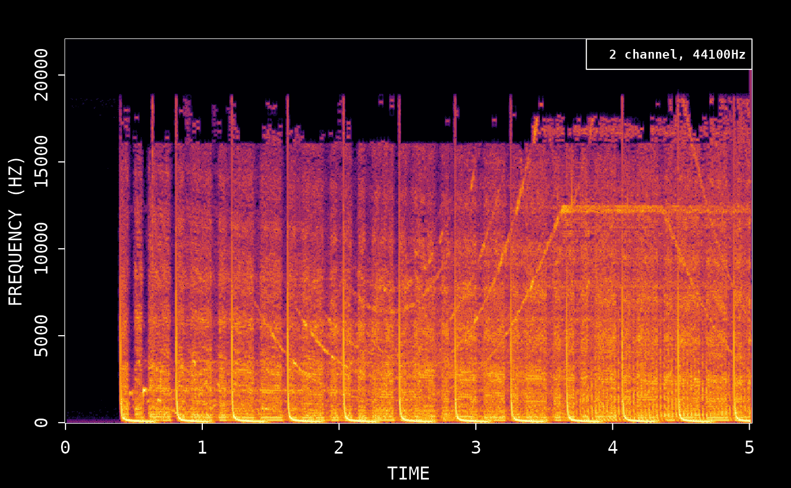
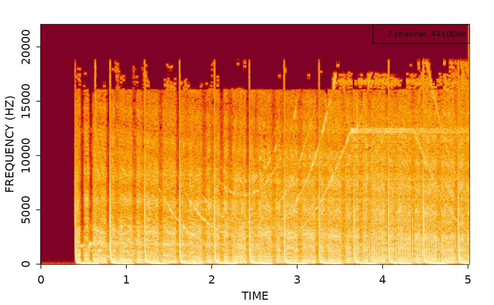
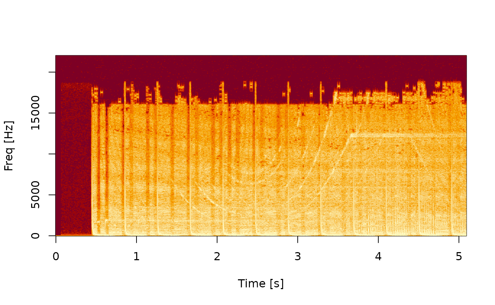
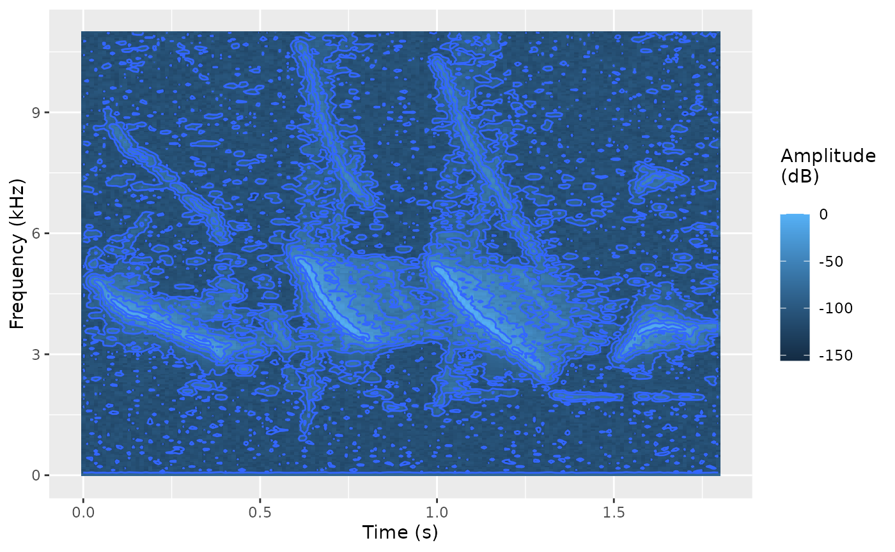
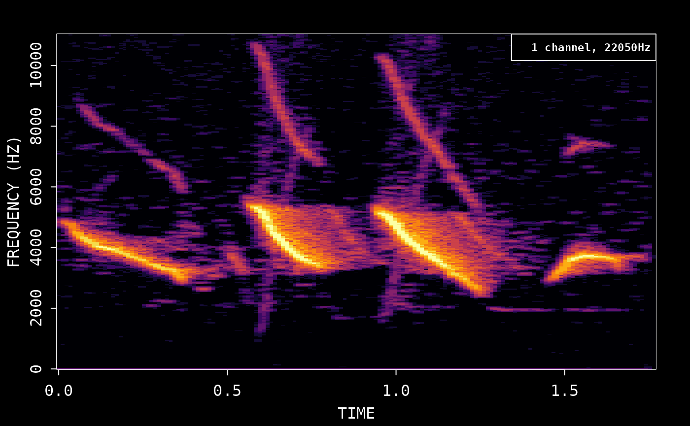
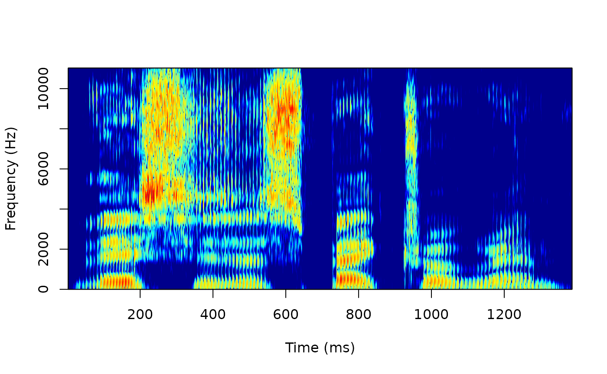
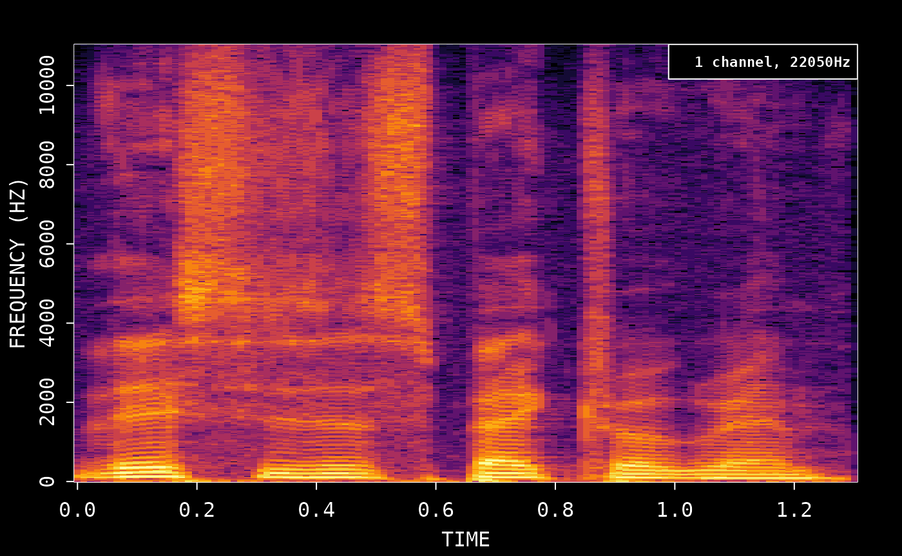

# Spectrograms in R using the 'av' package

Calculate the frequency data and plot the spectrogram:

``` r

# Demo sound included with av
wonderland <- system.file('samples/Synapsis-Wonderland.mp3', package='av')

# Read first 5 sec of demo
fft_data <- read_audio_fft(wonderland, end_time = 5.0)
plot(fft_data)
```



You can turn off dark mode to use the default R colors:

``` r

plot(fft_data, dark = FALSE)
```



## Spectrogram video

You can also create a spectrogram video like this:

``` r

# Create new audio file with first 5 sec
av_audio_convert(wonderland, 'short.mp3', total_time = 5)
#> [1] "short.mp3"
av_spectrogram_video('short.mp3', output = 'spectrogram.mp4', width = 1280, height = 720, res = 144)
```

Your browser does not support the video tag.

## Compare with tuneR/signal

For comparison, we show how the same thing can be achieved with the
`tuneR` package:

``` r

# Read wav with tuneR
data <- tuneR::readMP3('short.mp3')

# demean to remove DC offset
snd <- data@left - mean(data@left)
```

We then use the signal package to calculate the spectrogram with similar
parameters as av:

``` r

# create spectrogram
spec <- signal::specgram(x = snd, n = 1024, Fs = data@samp.rate, overlap = 1024 * 0.75)

# normalize and rescale to dB
P <- abs(spec$S)
P <- P/max(P)

out <- pmax(1e-6, P)
dim(out) <- dim(P)
out <- log10(out) / log10(1e-6)

# plot spectrogram
image(x = spec$t, y = spec$f, z = t(out), ylab = 'Freq [Hz]', xlab = 'Time [s]', useRaster=TRUE)
```



## Compare with seewave

Compare spectrograms using the `tico` audio sample included with the
seewave package:

``` r

library(seewave)
library(ggplot2)
data(tico)
ggspectro(tico, ovlp = 50) + geom_tile(aes(fill = amplitude)) + stat_contour()
#> Warning: `aes_string()` was deprecated in ggplot2 3.0.0.
#> ℹ Please use tidy evaluation idioms with `aes()`.
#> ℹ See also `vignette("ggplot2-in-packages")` for more information.
#> ℹ The deprecated feature was likely used in the seewave package.
#>   Please report the issue to the authors.
#> This warning is displayed once per session.
#> Call `lifecycle::last_lifecycle_warnings()` to see where this warning was
#> generated.
```



To use av, we first save the wav file and then create spectrogram:

``` r

# First export wav file
savewav(tico, filename = 'tico.wav')
plot(read_audio_fft('tico.wav'))
```



## Compare with phonTools

Use the audio sample included with phonTools:

``` r

library(phonTools)
#> 
#> Attaching package: 'phonTools'
#> The following object is masked from 'package:seewave':
#> 
#>     preemphasis
data(sound)
spectrogram(sound, maxfreq = sound$fs/2)
```



Save the wav file and then create spectrogram. We match the default
window function from phonTools:

``` r

phonTools::writesound(sound, 'sound.wav')
plot(read_audio_fft('sound.wav', window = phonTools::windowfunc(1024, 'kaiser')))
```


